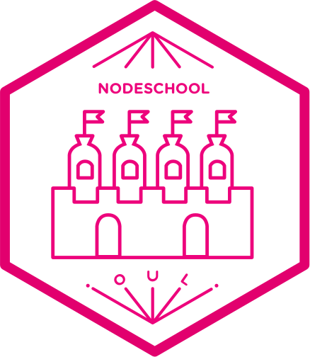

[NodeSchool Oulu](http://nodeschool.io/oulu/) :school::cop: [](https://ouluwebdevslackin.herokuapp.com) [](https://travis-ci.org/nodeschool/oulu) [](http://nodeschool.io/oulu/)
====================

Welcome to the NodeSchool Oulu chapter's repository. We use this
repository for our website and almost all our communication.

- [Check out our next events on Meetup.com](https://www.meetup.com/Oulu-Web-Development/)
- [Website](http://nodeschool.io/oulu/)

## Featured workshoppers

Here are the workshoppers we have been through during past events.

| Lesson | Description |
|--------|-------------|
|[`javascripting`](https://github.com/sethvincent/javascripting)|Learn the basics of JavaScript. No previous programming experience required.|
|[`learnyounode`](https://github.com/workshopper/learnyounode)|Learn the basics of node: asynchronous i/o, http.|

## Contributing to the website

The website is just basic HTML, CSS and JavaScript. It runs on [GitHub
Pages](https://pages.github.com/).

### Running locally

Here are useful commands:

```bash
# Get a local copy of the repository with the site in it.
git clone git@github.com:nodeschool/oulu.git
cd oulu
# Install the website's development dependencies.
npm install
# Run the site locally. Hit CTRL-C to stop the server
npm run start
# Test the site before pushing
npm run test:site
```

## Team

- [Thibaud Colas](https://twitter.com/thibaud_colas)

### Notes

#### Requirements

- Node and npm
- Text editor
- Terminal app
- Command-line knowledge
- Programming knowledge
- JavaScript knowledge

#### Links

https://github.com/nodeschool/organizers/wiki/Event-Mentor-Best-Practices#on-being-a-mentor
